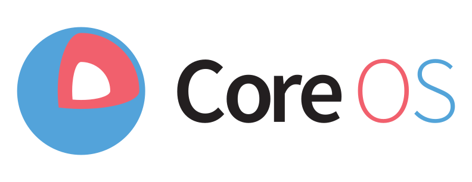

# STATEFUL KUBERNETES {bgcss=tw-colorful .light-on-dark}
<smaller>PAST, PRESENT, FUTURE</smaller>

# STATELESS KUBERNETES {bg=#97dce7}

```render_a2sketch
                      #------------#
                      |[c]         |
                      |  Users     |
                      |            |
                      #-----#------#
                            |
                            v
                      #-----#------#
                      |[o]         |
                      | Service    | service.namespace.svc.cluster.local
                      |            |
                      #-----#------#
                            |
             #--------------#--------------#
             |                             |
             v              |              v
#------------#------------.   #------------#------------.
|[p]                      | | |[p]                      |
| Pod                     |   | Pod                     |
|                         | | |                         |
#------------#------------.   #------------#------------#
|[w]         |[w]         | | |[w]         |[w]         |
| Container  | Container  |   | Container  | Container  |
|            |            | | |            |            |
#------------#------------#   #------------#------------#
|[w]                      | | |[w]                      |
| Host                    |   | Host                    |
| [zone=a]                | | | [zone=b]                |
'-------------------------#   '-------------------------#
                            |                           
Availability zone a           Availability zone b      
                            |

[c]: {"a2s:type": "cloud", "a2s:delref": true, "fill": "#fff", "fillStyle": "solid"}
[w]: {"a2s:delref": true, "fill": "#fff", "fillStyle": "solid", "strokeStyle": "#000"}
[g]: {"a2s:delref": true, "fill": "transparent", "fillStyle": "solid", "strokeStyle": "#000"}
[p]: {"a2s:delref": true, "fill": "#ef5ba1", "fillStyle": "solid", "strokeStyle": "#000"}
[o]: {"a2s:delref": true, "fill": "#f99c41", "fillStyle": "solid"}
```


# CONTAINER STORAGE FABLE {bg=#97dce7}

```render_a2sketch
                      #------------#
                      |[c]         |
                      |  Users     |
                      |            |
                      #-----#------#
                            |
                            v
                      #-----#------#
                      |[o]         |
                      | Service    |
                      |            |
                      #-----#------#
                            |
             #--------------#--------------#
             |                             |
             v              |              v
#------------#------------.   #------------#------------.
|[p]                      | | |[p]                      |
| Pod                     |   | Pod                     |
|                         | | |                         |
#-------------------------.   #-------------------------#
|[w]                      | | |[w]                      |
| Container    .----------#   | Container    .----------#
|              |[e] Store | | |              |[e] Store |
#--------------#----------#   #--------------#----------#
|[w]                      | | |[w]                      |
| Host                    |   | Host                    |
| [zone=a]                | | | [zone=b]                |
'-------------------------#   '-------------------------#
                            |                           
Availability zone a           Availability zone b      
                            |

[c]: {"a2s:type": "cloud", "a2s:delref": true, "fill": "#fff", "fillStyle": "solid"}
[w]: {"a2s:delref": true, "fill": "#fff", "fillStyle": "solid", "strokeStyle": "#000"}
[g]: {"a2s:delref": true, "fill": "transparent", "fillStyle": "solid", "strokeStyle": "#000"}
[p]: {"a2s:delref": true, "fill": "#ef5ba1", "fillStyle": "solid", "strokeStyle": "#000"}
[o]: {"a2s:delref": true, "fill": "#f99c41", "fillStyle": "solid"}
[e]: {"a2s:delref": true, "fill": "#00aa5b", "fillStyle": "solid", "strokeStyle": "#000"}
```

# CONTAINER BLOCK STORAGE {bg=#97dce7}

```render_a2sketch
                      #------------#
                      |[c]         |
                      |  Users     |
                      |            |
                      #-----#------#
                            |
                            v
                      #-----#------#
                      |[o]         |
                      | Service    |
                      |            |                       #-------------#
                      #-----#------#                       |[w]          |
                            |                        .----># PVC         |
             #--------------#--------------#         |     | (namespace) |
             |                             |         |     #-------#-----#
             v              |              v         |             |
#------------#------------.   #------------#---------#--.          v
|[p]                      | | |[p]                      |  #-------#-----#
| Pod                     |   | Pod                     |  |[w]          |
|                         | | |                         |  | PV          |
#------------#------------.   #------------#------------#  | (cluster)   |
|[w]         |[w]         | | |[w]         |[w]         |  #-------#-----#
| Container  | Container  |   | Container  | Container  |          |
|            |            | | |            |            |          |
#------------#------------#   #------------#------------#          |
|[w]                      | | |[w]                      |          |
| Host          .---------#   | Host          .---------#          |
| [zone=a]      |[e]Drive | | | [zone=b]      |[e]Drive |          |
'---------------#------#--#   '---------------#------#--#          |
                       ^    |                        ^             | 
Availability zone a    |      Availability zone b    |             |
                       '-----------------------------#-------------'
                                             mount RWO
[c]: {"a2s:type": "cloud", "a2s:delref": true, "fill": "#fff", "fillStyle": "solid"}
[w]: {"a2s:delref": true, "fill": "#fff", "fillStyle": "solid", "strokeStyle": "#000"}
[g]: {"a2s:delref": true, "fill": "transparent", "fillStyle": "solid", "strokeStyle": "#000"}
[p]: {"a2s:delref": true, "fill": "#ef5ba1", "fillStyle": "solid", "strokeStyle": "#000"}
[o]: {"a2s:delref": true, "fill": "#f99c41", "fillStyle": "solid"}
[e]: {"a2s:delref": true, "fill": "#00aa5b", "fillStyle": "solid", "strokeStyle": "#000"}
```

# CONTAINER NETWORK FILE STORAGE {bg=#97dce7}

```render_a2sketch
                      #------------#
                      |[c]         |
                      |  Users     |
                      |            |
                      #-----#------#
                            |
                            v
                      #-----#------#
                      |[o]         |
                      | Service    |
                      |            |                       #-------------#
                      #-----#------#                       |[w]          |
                            |                        .----># PVC         |
             #--------------#--------------#         |     | (namespace) |
             |                             |         |     #-------#-----#
             v              |              v         |             |
#------------#------------.   #------------#---------#--.          v
|[p]                      | | |[p]                      |  #-------#-----#
| Pod                     |   | Pod                     |  |[w]          |
|                         | | |                         |  | PV          |
#------------#------------.   #------------#------------#  | (cluster)   |
|[w]         |[w]         | | |[w]         |[w]         |  #-------#-----#
| Container  | Container  |   | Container  | Container  |          |
|            |            | | |            |            |          v
#------------#------------#   #------------#------------#  #-------#-----#
|[w]                      | | |[w]                      |  |[e]          |
| Host                    |   | Host                    |  | NFS         |   
| [zone=a]                | | | [zone=b]                |  |             |
'----------------------#--#   '----------------------#--#  #-------#-----#
                       ^    |                        ^             | 
Availability zone a    |      Availability zone b    |             |
                       '-----------------------------#-------------'
                                             mount RWX
[c]: {"a2s:type": "cloud", "a2s:delref": true, "fill": "#fff", "fillStyle": "solid"}
[w]: {"a2s:delref": true, "fill": "#fff", "fillStyle": "solid", "strokeStyle": "#000"}
[g]: {"a2s:delref": true, "fill": "transparent", "fillStyle": "solid", "strokeStyle": "#000"}
[p]: {"a2s:delref": true, "fill": "#ef5ba1", "fillStyle": "solid", "strokeStyle": "#000"}
[o]: {"a2s:delref": true, "fill": "#f99c41", "fillStyle": "solid"}
[e]: {"a2s:delref": true, "fill": "#00aa5b", "fillStyle": "solid", "strokeStyle": "#000"}
```

# TIMELINES {bg=#6a2469 .light-on-dark}

# IDENTITY {bg=#97dce7}

```{.render_plantuml args="-Sbackgroundcolor=transparent"}
@startuml
skinparam BoxPadding 10
skinparam defaultFontSize 18
Kubernetes->OpenShift : attribute-based access control (ABAC)
OpenShift->Kubernetes : roles and cluster-roles
Kubernetes->OpenShift : role-based access control (RBAC)
@enduml
```

<aside class="notes" data-markdown>
Since Red Hat embraced Kubernetes for OpenShift 3+, there have been numerous virtuous pizza effects, large and small. RBAC is an example that has worked particularly well.
</aside>

# NETWORKING {bg=#97dce7}

```{.render_plantuml args="-Sbackgroundcolor=transparent"}
@startuml
skinparam BoxPadding 10
skinparam defaultFontSize 18
Kubernetes->OpenShift : flat network
OpenShift->Kubernetes : multitenant plugin
OpenShift->Kubernetes : prototype network policies
Kubernetes->OpenShift : network policies
@enduml
```

<aside class="notes" data-markdown>
Network policies have arguably been less successful. The question is whether network policies warrant the considerable amount of complexity when placed alongside Red Hat's original `ovs-multitenant` plugin.
</aside>

# STATE {bg=#97dce7}

```{.render_plantuml args="-Sbackgroundcolor=transparent"}
@startuml
skinparam BoxPadding 10
skinparam defaultFontSize 18
Kubernetes->"Red Hat OpenShift" : beware stateful applications
"Red Hat OpenShift"->Kubernetes : application templates (2015)
Kubernetes->"CoreOS Tectonic" : stateful applications still hard
"CoreOS Tectonic"->Kubernetes : etcd operator with third-party resources (2016)
Kubernetes->"CoreOS Tectonic" : Custom Resource Definitions
"CoreOS Tectonic"->Kubernetes : Operator Framework and SDK (2018)
"CoreOS Tectonic"->"Red Hat OpenShift" : merges with (2019)
@enduml
```

# THE OPERATOR LIFE {bg=#6a2469 .light-on-dark}

# OPERATORS {bg=#fff44d}

```render_a2sketch
#--------------------------#     #-------------------------#       
|[p]                       |     |[b]                      |      
|                          |     |                         |      
|                          |     |                         |      
|Custom Resource Definition+--+--+        Controller       |       
|                          |  |  |                         |      
|  (e.g. "VaultService")   |  |  | (backup, upgrade, etc.) |      
|                          |  |  |                         |      
|                          |  |  |                         |      
#--------------------------#  |  #-------------------------#       
                              |
                              |
                              v
                 #------------+-------------#  
                 |[s]                       | 
                 |                          | 
                 |                          |  
                 |                          | 
                 |                          | 
                 |   Cluster state (etcd)   |  
                 |                          | 
                 |    PersistentVolumes     |  
                 |                          | 
                 |        ConfigMaps        |  
                 |                          | 
                 |          Secrets         |  
                 #--------------------------#  


[p]: {"a2s:delref": true, "fill": "#ef5ba1", "fillStyle": "solid", "strokeStyle": "#000"}
[b]: {"a2s:delref": true, "fill": "#f99c41", "fillStyle": "solid", "strokeStyle": "#000"}
[s]: {"a2s:type":"storage", "a2s:delref": true, "fillStyle": "solid", "fill": "#ffffff"}
```

# STATEFUL WORKLOADS {bg=#97dce7}

```render_a2sketch
#------------------------------------------------------------------#
|[q]                                                               |
|                                                                  |
|                                                                  |
|                                                                  |
|    Stateless is Easy, Stateful is Hard.                          |
|                                                                  |
|                                   - Brandon Philips (2016)       |
|                                                                  |
|                                                                  |
|                                                                  |
#------------------------------------------------------------------#

[q]: {"a2s:type": "quote-sw", "a2s:delref": true, "fill": "#ef5ba1", "fillStyle": "solid"}
```

<div class="tiny">Source: <a href="https://coreos.com/blog/introducing-operators.html">coreos.com/blog/introducing-operators.html</a></div> 

# CORPORATE SPONSORS {bg=#fff44d}

Vault operator<br/>


MySQL operator<br/>


PostgreSQL operator<br/>


# RESILIENCE {bg=#6a2469 .light-on-dark}

# SHARED OWNERSHIP {bg=#97dce7}

```render_a2sketch
.-----------------------------------------------------------.
|[t]                                                        |
| #-------------------------#   #-------------------------# |     
| |[p]                      |   |[b]                      | |    
| |                         |   |        IBM              | |    
| |      Microsoft          |   |        Red Hat          | |     
| |                         |   |        CoreOS           | |    
| |                         |   |                         | |    
| #-------------------------#   #-------------------------# |     
|                                                           |
|           #----------------------------------#            |
|           |[c]                               |            |
|           |                                  |            |
|           |              Google              |            |
|           |                                  |            |
|           |                                  |            |
|           #----------------------------------#            |
|                                                           |
| #-------------------------#   #-------------------------# |     
| |[d]                      |   |[e]                      | |    
| |                         |   |                         | |     
| |        VMware           |   |        Alibaba          | |      
| |                         |   |                         | |     
| |                         |   |                         | |     
| #-------------------------#   #-------------------------# |     
|                                                           |
|          Cloud Native Computing Foundation (CNCF)         |
|                                                           |
'-----------------------------------------------------------'
 
[c]: {"a2s:delref": true, "fill": "#fff", "fillStyle": "solid"}
[p]: {"a2s:delref": true, "fill": "#ef5ba1", "fillStyle": "solid", "strokeStyle": "#000"}
[b]: {"a2s:delref": true, "fill": "#f99c41", "fillStyle": "solid", "strokeStyle": "#000"}
[d]: {"a2s:delref": true, "fill": "#27bdce", "fillStyle": "solid", "strokeStyle": "#000"}
[e]: {"a2s:delref": true, "fill": "#00aa5b", "fillStyle": "solid", "strokeStyle": "#000"}
[t]: {"a2s:delref": true, "fill": "transparent", "fillStyle": "solid", "strokeStyle": "#000"}

```

# PRECONDITIONS {bg=#97dce7}

```render_a2sketch

.---------------------------------------------------#
|[w]                                                |
| open source                                       |
|                                                   |
#---------------------------------------------------#
|[w]                                                |
| neutral IP ownership                              |
|                                                   |
#---------------------------------------------------#
|[w]                                                |
| extensibility                                     |
|                                                   |
#---------------------------------------------------'

[w]: {"a2s:delref": true, "fill": "#fff", "fillStyle": "solid"}
[p]: {"a2s:delref": true, "fill": "#ef5ba1", "fillStyle": "solid", "strokeStyle": "#000"}
[b]: {"a2s:delref": true, "fill": "#f99c41", "fillStyle": "solid", "strokeStyle": "#000"}
[d]: {"a2s:delref": true, "fill": "#27bdce", "fillStyle": "solid", "strokeStyle": "#000"}
[e]: {"a2s:delref": true, "fill": "#00aa5b", "fillStyle": "solid", "strokeStyle": "#000"}


```

# PRECONDITIONS {bg=#97dce7}

```render_a2sketch

.---------------------------------------------------#
|[p]                                                |
| open source - Apache                              |
|                                                   |
#---------------------------------------------------#
|[w]                                                |
| neutral IP ownership                              |
|                                                   |
#---------------------------------------------------#
|[w]                                                |
| extensibility                                     |
|                                                   |
#---------------------------------------------------'

[w]: {"a2s:delref": true, "fill": "#fff", "fillStyle": "solid"}
[p]: {"a2s:delref": true, "fill": "#ef5ba1", "fillStyle": "solid", "strokeStyle": "#000"}
[b]: {"a2s:delref": true, "fill": "#f99c41", "fillStyle": "solid", "strokeStyle": "#000"}
[d]: {"a2s:delref": true, "fill": "#27bdce", "fillStyle": "solid", "strokeStyle": "#000"}
[e]: {"a2s:delref": true, "fill": "#00aa5b", "fillStyle": "solid", "strokeStyle": "#000"}

```

A suitably permissive license is a necessary but not sufficient precondition.

# PRECONDITIONS {bg=#97dce7}

```render_a2sketch
.---------------------------------------------------#
|[p]                                                |
| open source - Apache                              |
|                                                   |
#---------------------------------------------------#
|[b]                                                |
| neutral IP ownership - CNCF                       |
|                                                   |
#---------------------------------------------------#
|[w]                                                |
| extensibility                                     |
|                                                   |
#---------------------------------------------------'

#---------------------------------------------------#
|[q]                                                |
|                                                   |
|                                                   |
|                                                   |
| K8s would *not* be what it is today without       |
|                                                   |
| neutral IP ownership... K8s has spawned an entire |
|                                                   |
| ecosystem *because* it can be used by consuming   |
|                                                   |
| projects/products without fear.                   |
|                                                   |
|                             - Matt Klein          |
|                                                   |
|                                                   |
|                                                   |
|                                                   |
#---------------------------------------------------#
[q]: {"a2s:type": "quote-sw", "a2s:delref": true, "fill": "#f99c41", "fillStyle": "solid"}
[w]: {"a2s:delref": true, "fill": "#fff", "fillStyle": "solid"}
[p]: {"a2s:delref": true, "fill": "#ef5ba1", "fillStyle": "solid", "strokeStyle": "#000"}
[b]: {"a2s:delref": true, "fill": "#f99c41", "fillStyle": "solid", "strokeStyle": "#000"}
[d]: {"a2s:delref": true, "fill": "#27bdce", "fillStyle": "solid", "strokeStyle": "#000"}
[e]: {"a2s:delref": true, "fill": "#00aa5b", "fillStyle": "solid", "strokeStyle": "#000"}
```
<div class="tiny">Source: <a href="https://twitter.com/mattklein123/status/1229513052673855488?ref_src=twsrc%5Etfw">@mattklein123 on Twitter</a>, 17 February 2020.</div> 

# PRECONDITIONS {bg=#97dce7}

```render_a2sketch

.---------------------------------------------------#
|[p]                                                |
| open source - Apache                              |
|                                                   |
#---------------------------------------------------#
|[b]                                                |
| neutral IP ownership - CNCF                       |
|                                                   |
#---------------------------------------------------#
|[d]                                                |
| extensibility - controllers and operators         |
|                                                   |
#---------------------------------------------------'

[w]: {"a2s:delref": true, "fill": "#fff", "fillStyle": "solid"}
[p]: {"a2s:delref": true, "fill": "#ef5ba1", "fillStyle": "solid", "strokeStyle": "#000"}
[b]: {"a2s:delref": true, "fill": "#f99c41", "fillStyle": "solid", "strokeStyle": "#000"}
[d]: {"a2s:delref": true, "fill": "#27bdce", "fillStyle": "solid", "strokeStyle": "#000"}
[e]: {"a2s:delref": true, "fill": "#00aa5b", "fillStyle": "solid", "strokeStyle": "#000"}

```

**Controllers** add custom processing to the core reconciliation loop.

When paired with custom resource definitions, they are known as **operators**.

# SOUL-SEARCHING AT THE BAZAAR {bg=#6a2469 .light-on-dark}

# FALLING OUT OVER STORAGE {bg=#97dce7}

```render_a2sketch
     #-----------------------------------------------------------#
     |[w]                                                        |
     | #-------------------------#   #-------------------------# |      
     | |[p]                      |   |[b]                      | |    
     | |     Azure Key Vault     |   |       Cosmos DB         | |     
     | |                         |   |                         | |    
     | #-------------------------#   #-------------------------# |     
     |           #----------------------------------#            |
     |           |[w]                               |            |
     |           |              AKS                 |            |
     |           |                                  |            |
     |           #----------------------------------#            |
     | #-------------------------#   #-------------------------# |     
     | |[d]                      |   |[e]                      | |    
     | |      Azure DevOps       |   |   Azure Queue Storage   | |      
     | |                         |   |                         | |     
     | #-------------------------#   #-------------------------# |     
     |                           Azure                           |     
     #-----------------------------#-----------------------------#     

[w]: {"a2s:delref": true, "fill": "#fff", "fillStyle": "solid"}
[p]: {"a2s:delref": true, "fill": "#ef5ba1", "fillStyle": "solid", "strokeStyle": "#000"}
[b]: {"a2s:delref": true, "fill": "#f99c41", "fillStyle": "solid", "strokeStyle": "#000"}
[d]: {"a2s:delref": true, "fill": "#27bdce", "fillStyle": "solid", "strokeStyle": "#000"}
[e]: {"a2s:delref": true, "fill": "#00aa5b", "fillStyle": "solid", "strokeStyle": "#000"}

```

Cloud vendors perfected the use of proprietary services based on open source products, putting companies creating those products on notice.

In 2016 MongoDB Inc. responded with the <a href="https://www.mongodb.com/community/licensing">Server Side Public License</a>.

# A PORTABLE STACK {bg=#97dce7}

```render_a2sketch
  
     #-----------------------------#-----------------------------#
     |[w]                                                        |
     | #-------------------------#   #-------------------------# |      
     | |[p]                      |   |[b]                      | |    
     | |     Vault operator      |   |   PostgreSQL operator   | |     
     | |                         |   |                         | |    
     | #-------------------------#   #-------------------------# |     
     |                                                           |    
     | #-------------------------#   #-------------------------# |     
     | |[d]                      |   |[e]                      | |    
     | |       Jenkins X         |   |     Kafka operator      | |      
     | |                         |   |                         | |     
     | #-------------------------#   #-------------------------# |     
     |                Any managed Kubernetes service             |     
     #-----------------------------------------------------------#     

[w]: {"a2s:delref": true, "fill": "#fff", "fillStyle": "solid"}
[p]: {"a2s:delref": true, "fill": "#ef5ba1", "fillStyle": "solid", "strokeStyle": "#000"}
[b]: {"a2s:delref": true, "fill": "#f99c41", "fillStyle": "solid", "strokeStyle": "#000"}
[d]: {"a2s:delref": true, "fill": "#27bdce", "fillStyle": "solid", "strokeStyle": "#000"}
[e]: {"a2s:delref": true, "fill": "#00aa5b", "fillStyle": "solid", "strokeStyle": "#000"}

```

# INFRASTRUCTURE AS ~~CODE~~DATA  {bg=#97dce7}

```render_a2sketch
#-----------------------------------------------------------------#
|[q]                                                              |
|                                                                 |
|                                                                 |
|                                                                 |
|  Declarative configuration is about treating infrastructure as  |
|                                                                 |
|  data, which is more portable than code, and enables workflows  |
|                                                                 |
|  that manipulate desired state based on policy.                 |
|                                                                 |
|                                   - Kelsey Hightower (2019)     |
|                                                                 |
|                                                                 |
|                                                                 |
#-----------------------------------------------------------------#

[q]: {"a2s:type": "quote-sw", "a2s:delref": true, "fill": "#ef5ba1", "fillStyle": "solid"}
```

<div class="tiny">Source: <a href="https://twitter.com/kelseyhightower/status/1164194470436302848">@kelseyhightower on Twitter, 21 August 2019</a>.</div>

# DESIRED STATE {bg=#97dce7}

```render_a2sketch
     #-----------------------------------------------------------#                  -#         
     |[w]                                                        |                   |   
     | #-------------------------#   #-------------------------# |                   |   
     | |[p]                      |   |[b]                      | |                   #----------.
     | |     Secrets Manager     |   |           RDS           | |                   |          |
     | |                         |   |                         | |                   |          |
     | #-------------------------#   #-------------------------# |                  -#          |
     |           #----------------------------------#            |              -#              |
     |           |[w]                               |            |               |        plan, |
     |           |              EKS                 |            | reconciliation|       apply, |
     |           |                                  |            |     loop      |   save state |
     |           #----------------------------------#            |              -#              |
     | #-------------------------#   #-------------------------# |                  -#          |
     | |[d]                      |   |[e]                      | |                   |          |
     | |      CodeDeploy         |   |             SQS         | |                   |          |
     | |                         |   |                         | |                   #----------'
     | #-------------------------#   #-------------------------# |                   |   
     |                            AWS                            |                   |   
     #-----------------------------#-----------------------------#                  -#   
            Infrastructure as CODE | 
                                   |
                                   |
                                   |
                                   v Infrastructure as DATA                          -#
     #-----------------------------#-----------------------------#                    #---------.
     |[w]                                                        |                   -#         |
     | #-------------------------#   #-------------------------# |              -#              |
     | |[p]                      |   |[b]                      | |               |              |
     | |     Vault operator      |   |   PostgreSQL operator   | |               |              |
     | |                         |   |                         | |               |              |
     | #-------------------------#   #-------------------------# |               |        plan, |
     |                                                           | reconciliation|       apply, |
     | #-------------------------#   #-------------------------# |     loop      |   save state |
     | |[d]                      |   |[e]                      | |               |              |
     | |       Jenkins X         |   |     Kafka operator      | |               |              |
     | |                         |   |                         | |               |              |
     | #-------------------------#   #-------------------------# |              -#              |
     |                Any managed Kubernetes service             |                   -#         | 
     #-----------------------------------------------------------#                    #---------' 
                                                                                     -#

[w]: {"a2s:delref": true, "fill": "#fff", "fillStyle": "solid"}
[p]: {"a2s:delref": true, "fill": "#ef5ba1", "fillStyle": "solid", "strokeStyle": "#000"}
[b]: {"a2s:delref": true, "fill": "#f99c41", "fillStyle": "solid", "strokeStyle": "#000"}
[d]: {"a2s:delref": true, "fill": "#27bdce", "fillStyle": "solid", "strokeStyle": "#000"}
[e]: {"a2s:delref": true, "fill": "#00aa5b", "fillStyle": "solid", "strokeStyle": "#000"}
```

<aside class="notes" data-markdown>
</aside>

# CONFIGURATION {bg=#97dce7}

```render_a2sketch
     #-----------------------------------------------------------#                                    -#
     |[w]                                                        |                    -#               |
     | #-------------------------#   #-------------------------# |                     |               |
     | |[p]                      |   |[b]                      | |                     |               |
     | |     Secrets Manager     |   |           RDS           | |                     |               |
     | |                         |   |                         | |                     |               |
     | #-------------------------#   #-------------------------# |     -#              |               |
     |           #----------------------------------#            |      |              |               |
     |           |[w]                               |            | RBAC |  IAM         |               |
     |           |              EKS                 |            | CNI  |  SGs & NACLs |  Terraform    |
     |           |                                  |            | CSI  |  S3/EBS/EFS  |  (1000+ lines)|
     |           #----------------------------------#            |      |              |               |
     | #-------------------------#   #-------------------------# |     -#              |               |
     | |[d]                      |   |[e]                      | |                     |               |
     | |      CodeDeploy         |   |             SQS         | |                     |               |
     | |                         |   |                         | |                     |               |
     | #-------------------------#   #-------------------------# |                     |               |
     |                            AWS                            |                    -#               |
     #-----------------------------#-----------------------------#                                    -#
            Infrastructure as CODE | 
                                   |
                                   |
                                   |
                                   v Infrastructure as DATA
     #-----------------------------#-----------------------------#                    -#
     |[w]                                                        |     -#              |
     | #-------------------------#   #-------------------------# |      |              |
     | |[p]                      |   |[b]                      | |      |              |
     | |     Vault operator      |   |   PostgreSQL operator   | |      |              |
     | |                         |   |                         | |      |              |
     | #-------------------------#   #-------------------------# | RBAC |              |
     |                                                           | CNI  |  Terraform   |
     | #-------------------------#   #-------------------------# | CSI  |  (100+ lines)|
     | |[d]                      |   |[e]                      | |      |              |
     | |       Jenkins X         |   |     Kafka operator      | |      |              |
     | |                         |   |                         | |      |              |
     | #-------------------------#   #-------------------------# |      |              |
     |                Any managed Kubernetes service             |     -#              |
     #-----------------------------------------------------------#                    -#

[w]: {"a2s:delref": true, "fill": "#fff", "fillStyle": "solid"}
[p]: {"a2s:delref": true, "fill": "#ef5ba1", "fillStyle": "solid", "strokeStyle": "#000"}
[b]: {"a2s:delref": true, "fill": "#f99c41", "fillStyle": "solid", "strokeStyle": "#000"}
[d]: {"a2s:delref": true, "fill": "#27bdce", "fillStyle": "solid", "strokeStyle": "#000"}
[e]: {"a2s:delref": true, "fill": "#00aa5b", "fillStyle": "solid", "strokeStyle": "#000"}
```

<aside class="notes" data-markdown>
This is the crux of the matter. So far from introducing additional complexity, the operator approach promises to reduce complexity dramatically.

This is arguably far more valuable than the reduction in cloud stickiness and lock-in, which is often the main or even sole argument put forward - after all, many companies are happy to commit to a single cloud vendor for now.
</aside>

# NATIVE RESOURCES {bg=#97dce7}

```render_a2sketch

#---------------------------------------------------------------------#
|[q]                                                                  |
|                                                                     |
|                                                                     |
|  Can I trust custom resources to create and manage the lifecycle    |
|                                                                     |
|  of objects native to the platform?                                 |
|                                                                     |
|                                                                     |
|                                                                     |
#---------------------------------------------------------------------#

            #---------------------------------------------------------------------#
            |[a]                                                                  |
            |                                                                     |
            |                                                                     |
            |  Yes, this is something resources like PersistentVolumeClaim and    |
            |                                                                     |
            |  Service have done for a long time, dynamically creating storage    |
            |                                                                     |
            |  volumes and load balancers respectively.                           |
            |                                                                     |
            |                                                                     |
            |                                                                     |
            #---------------------------------------------------------------------#     


[q]: {"a2s:type": "quote-sw", "a2s:delref": true, "fill": "#ef5ba1", "fillStyle": "solid"}
[a]: {"a2s:type": "quote-se", "a2s:delref": true, "fill": "#6a2469", "fillStyle": "solid"}
```

# SERVICE LEVEL {bg=#97dce7}

```render_a2sketch

#---------------------------------------------------------------------#
|[q]                                                                  |
|                                                                     |
|                                                                     |
|  Can the PostgreSQL operator match the availability and durability  |
|                                                                     |
|  guarantees of RDS?                                                 |
|                                                                     |
|                                                                     |
|                                                                     |
#---------------------------------------------------------------------#     

            #---------------------------------------------------------------------#
            |[a]                                                                  |
            |                                                                     |
            |                                                                     |
            |  Not today, no. It is worth considering, though, that:              |
            |                                                                     |
            |  * RDS and the operator use the same AWS storage primitives         |
            |                                                                     |
            |  * Until this improves, the operator could manage RDS on AWS        |
            |                                                                     |
            |                                                                     |
            |                                                                     |
            #---------------------------------------------------------------------#     


[q]: {"a2s:type": "quote-sw", "a2s:delref": true, "fill": "#ef5ba1", "fillStyle": "solid"}
[a]: {"a2s:type": "quote-se", "a2s:delref": true, "fill": "#6a2469", "fillStyle": "solid"}
```

# WHAT'S IN IT FOR CLOUD VENDORS? {bg=#fff44d}

Remember these?

<div class="xkcd" style="font-size: 0.7em">
Alexa for Business, Amazon AppFlow, Amazon Augmented AI, Amazon Braket, Amazon Chime, Amazon CodeGuru, Amazon Comprehend, Amazon Connect, Amazon DocumentDB, Amazon EventBridge, Amazon Forecast, Amazon Fraud Detector, Amazon GameLift, Amazon Honeycode, Amazon Interactive Video Service, Amazon Kendra, Amazon Keyspaces, Amazon Lex, Amazon Macie, Amazon Managed Blockchain, Amazon MQ, Amazon Personalize, Amazon Polly, Amazon QLDB, Amazon Redshift, Amazon Rekognition, Amazon SageMaker, Amazon Sumerian, Amazon Textract, Amazon Transcribe, Amazon Translate, API Gateway, Application Discovery Service, AppStream 2.0, Artifact, Athena, AWS Amplify, AWS App Mesh, AWS AppConfig, AWS AppSync, AWS Auto Scaling, AWS Backup, AWS Budgets, AWS Chatbot, AWS Cloud Map, AWS Compute Optimizer, AWS Cost Explorer, AWS Data Exchange, AWS DeepComposer, AWS DeepLens, AWS DeepRacer, AWS Firewall Manager, AWS Glue, AWS IQ, AWS Lake Formation, AWS License Manager, AWS Marketplace Subscriptions, AWS Migration Hub, AWS Organizations, AWS Outposts, AWS RoboMaker, AWS Single Sign-On, AWS Snow Family, AWS Transfer Family, AWS Well-Architected Tool, Batch, Certificate Manager, Cloud9, CloudFormation, CloudFront, CloudHSM, CloudSearch, CloudTrail, CloudWatch, CodeArtifact, CodeBuild, CodeCommit, CodeDeploy, CodePipeline, CodeStar, Cognito, Config, Control Tower, Data Pipeline, Database Migration Service, DataSync, Detective, Device Farm, Direct Connect, Directory Service, DynamoDB, EC2, EC2 Image Builder, EFS, Elastic Beanstalk, Elastic Container Registry, Elastic Container Service, Elastic Kubernetes Service, Elastic Transcoder, ElastiCache, Elasticsearch Service, Elemental Appliances & Software, EMR, FreeRTOS, FSx, Global Accelerator, Ground Station, GuardDuty, IAM, Inspector, IoT 1-Click, IoT Analytics, IoT Core, IoT Device Defender, IoT Device Management, IoT Events, IoT Greengrass, IoT SiteWise, IoT Things Graph, Key Management Service, Kinesis, Kinesis Video Streams, Lambda, Launch Wizard, Lightsail, Managed Services, MediaConnect, MediaConvert, MediaLive, MediaPackage, MediaStore, MediaTailor, Mobile Hub, MSK, Neptune, OpsWorks, Personal Health Dashboard, Pinpoint, QuickSight, RDS, Resource Access Manager, Route 53, S3, S3 Glacier, Secrets Manager, Security Hub, Server Migration Service, Serverless Application Repository, Service Catalog, Simple Email Service, Simple Notification Service, Simple Queue Service, Step Functions, Storage Gateway, Support, SWF, Systems Manager, Trusted Advisor, VPC, WAF & Shield, WorkDocs, WorkLink, WorkMail, WorkSpaces, X-Ray
</div>

Imagine **not** having to compete with this wall of products, offering a catalog of managed open source products with first-party support instead.

<aside class="notes" data-markdown>
Doubling down on their managed Kubernetes offerings promises huge benefits for Amazon's competitors. The competitive edge of the full roster of proprietary services is at least blunted if there is a vibrant ecosystem of open source middleware known to run reliably on all public clouds.
</aside>

# THANK YOU {bgcss=tw-colorful .light-on-dark}

Slides built with <a href="https://github.com/arnehilmann/markdeck">Markdeck</a><br/>
GitHub <a href="https://github.com/gerald1248/kubernetes-open-source-slides">gerald1248/kubernetes-open-source-slides</a><br/>
Twitter <a href="https://twitter.com/03spirit">@03spirit</a><br/>
LinkedIn <a href="https://www.linkedin.com/in/gerald1248/">gerald1248</a>


